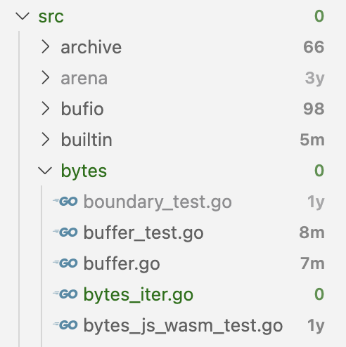

# Git File Age

Visualize file ages in VS Code's file explorer based on their last git modification dates.

## Features

* Shows file age indicators in the file explorer
* Recent files (≤ 7 days) are highlighted in green
* Old files (≥ 100 days) are greyed out

## Commands

* `Git File Age: Toggle` - Enable/disable the decorations
* `Git File Age: Refresh` - Refresh the decorations
* `Git File Age: Update threshold for new files` - Set days threshold for recent files (0 to disable)
* `Git File Age: Update threshold for old files` - Set days threshold for old files (999999 to disable)

## Settings

* `git-file-age.enabled` - Enable/disable the extension
* `git-file-age.recentThresholdDays` - Days threshold for recent files (default: 7)
* `git-file-age.oldThresholdDays` - Days threshold for old files (default: 100)
